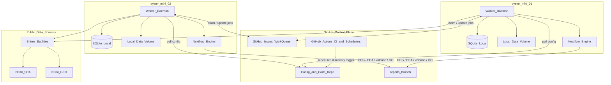
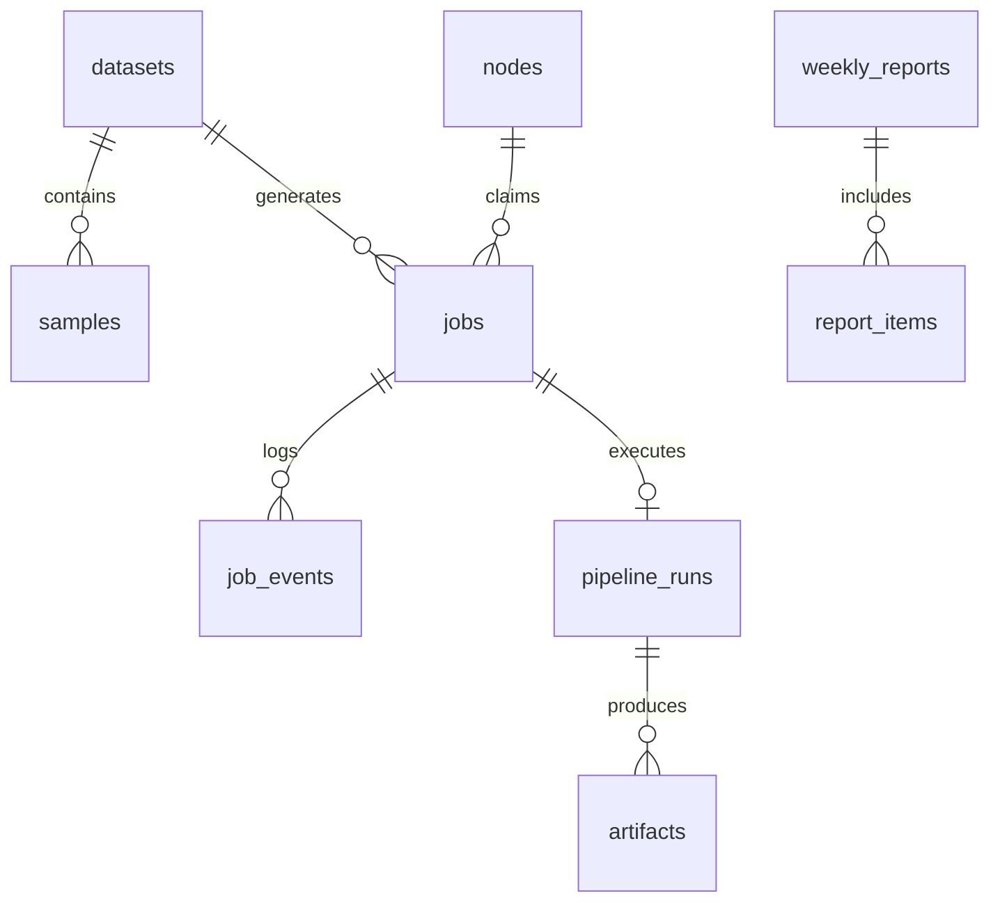
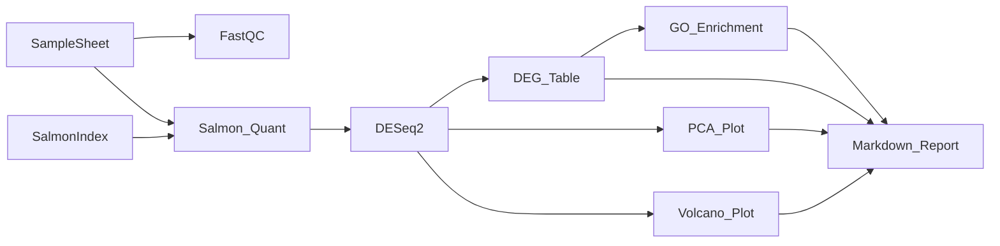

# Architecture

**public-omics-watchtower** is an autonomous public omics discovery platform for marine genomics and aquaculture research. It continuously monitors NCBI SRA and GEO, prioritizes datasets relevant to marine stress biology, downloads selected studies, and runs reproducible RNA-seq workflows on Apple Silicon Mac minis.

GitHub serves as the **control plane**. Mac mini workers serve as **execution nodes**. GitHub Issues serve as the **distributed work queue**.

---

## System Overview



### Deployment View (ASCII)

```
┌─────────────────────────────────────────────────────────────────────────┐
│                        GitHub (Control Plane)                           │
│  ┌──────────────┐  ┌─────────────────┐  ┌──────────────────────────────┐  │
│  │ config/*.yaml│  │ pipelines/*.nf  │  │ Issues = distributed queue   │  │
│  │ schemas/*.sql│  │ watchtower/ py  │  │ labels + YAML issue body     │  │
│  └──────────────┘  └─────────────────┘  └──────────────────────────────┘  │
│  ┌──────────────────────────────────────────────────────────────────────┐ │
│  │ Actions: lint/test, weekly report trigger, discovery cron (optional) │ │
│  └──────────────────────────────────────────────────────────────────────┘ │
└─────────────────────────────────────────────────────────────────────────┘
         ▲ git pull                              ▲ claim / update issues
         │                                      │
    ┌────┴────────────┐                   ┌─────┴────────────┐
    │ oyster-mini-01  │                   │ oyster-mini-02   │
    │ launchd worker  │                   │ launchd worker   │
    │ SQLite (cache)  │                   │ SQLite (cache)   │
    │ /data/watchtower│                   │ /data/watchtower │
    │ Nextflow+Salmon │                   │ Nextflow+Salmon  │
    └─────────────────┘                   └──────────────────┘
              │                                       │
              └──────────────┬────────────────────────┘
                             ▼
              ┌──────────────────────────────┐
              │ NCBI Entrez / SRA / GEO APIs │
              └──────────────────────────────┘
```

---

## Design Principles

| Principle | Description |
|-----------|-------------|
| Configuration over code | Species, repositories, scoring, pipelines, and node identity live in YAML |
| Reproducibility | Pinned tool versions, Nextflow reports/traces, run manifests in SQLite |
| Idempotent jobs | Stable `job_id` per accession + analysis profile; safe retries |
| Small artifacts in Git | Reports, plots, and tables sync to `reports` branch; FASTQ stays local |
| Phase isolation | Phase 1 is a vertical slice; Phase 2/3 extend without rewriting the job model |

---

## Technology Stack

| Layer | Technology | Role |
|-------|------------|------|
| Orchestration | Python 3.9+ | Discovery, scoring, worker daemon, reporting glue |
| Workflows | Nextflow 24.x | Salmon → DESeq2 → GO enrichment |
| Statistics | R 4.3+ (DESeq2, clusterProfiler) | Differential expression, enrichment, plots |
| Quantification | Salmon 1.10+ | Transcript-level quantification |
| Download | sra-tools | SRA prefetch and fasterq-dump |
| Configuration | YAML + JSON Schema | Runtime and scientific parameters |
| Local database | SQLite 3 | Per-node cache, run manifests, offline resilience |
| Work queue | GitHub Issues API | Distributed job queue and audit trail |
| CI/CD | GitHub Actions | Tests, scheduled discovery, weekly reports |
| Process manager | macOS launchd | Long-running worker daemons |
| Environment | mamba/conda (osx-arm64) | Apple Silicon bioinformatics binaries |
| Templates | Jinja2 | Markdown report generation |
| Secrets | macOS Keychain + GitHub Secrets | API tokens never committed |
| Future AI | Pluggable providers | Prioritization and interpretation (Phase 2+) |

**Explicitly excluded:** Kubernetes, cloud VMs, paid orchestrators, managed workflow engines.

---

## Job Lifecycle

Every unit of work is a GitHub Issue with YAML frontmatter. Workers claim issues via labels.

```
discover → download → analyze → report → weekly digest
```


### Job Types

| Type | Handler | Input | Output |
|------|---------|-------|--------|
| `discover` | `watchtower.worker.handlers.discover` | Entrez queries from species/repo config | New datasets in SQLite; download issues for high-score hits |
| `download` | `watchtower.worker.handlers.download` | SRA/GEO accession | Staged FASTQ + `samplesheet.csv` under `{data_root}/raw/` |
| `analyze` | `watchtower.worker.handlers.analyze` | Sample sheet + Salmon index | Nextflow run under `{data_root}/runs/{run_id}/` |
| `report` | `watchtower.worker.handlers.report` | Pipeline artifacts | Markdown report; sync to `reports` branch |

### Issue Body Format

```yaml
---
job_id: "SRR12345678:analyze:rnaseq_v1"
job_type: analyze
dataset_id: "sra:SRR12345678"
species: crassostrea_gigas
priority: 82
payload:
  accessions: [SRR12345678]
  samplesheet: /Volumes/omics/watchtower/raw/sra/SRR12345678/samplesheet.csv
  pipeline: rnaseq_salmon_deseq2
created_by: discovery@watchtower
schema_version: 1
---
## Job context
Pacific oyster heat stress RNA-seq...
```

### Label Taxonomy

| Label | Meaning |
|-------|---------|
| `job:discover` / `job:download` / `job:analyze` / `job:report` | Job type |
| `status:queued` / `status:running` / `status:completed` / `status:failed` | Lifecycle |
| `species:crassostrea_gigas` | Species routing |
| `priority:high` / `priority:normal` / `priority:low` | Derived from relevance score |
| `claimed-by:oyster-mini-01` | Active worker claim |
| `needs:human` | Manual review required |

---

## Worker Node Architecture

Each Mac mini runs a `watchtower worker` daemon managed by launchd.

### Lifecycle

```
START → load config → validate schema → register node heartbeat
      → sync GitHub Issues → SQLite
      → poll loop:
           1. check local resources (disk, running jobs)
           2. find claimable Issues (label query)
           3. atomically claim via GitHub API
           4. dispatch handler by job_type
           5. update Issue + SQLite on completion/failure
           6. sleep(poll_interval)
```

### Claim Protocol

1. Worker adds label `claimed-by:{node_id}`
2. Worker removes `status:queued`, adds `status:running`
3. Worker posts comment with `job_id` and timestamp
4. Only one worker succeeds; others skip on label conflict

### Stale Claim Recovery

Issues with `status:running` and no update for 24 hours are reset to `status:queued` by housekeeping (`watchtower worker housekeeping` or the weekly GitHub Action).

### Node Routing

Node capabilities are defined in `config/nodes/{node_id}.yaml`. A **single Mac mini** can run the full pipeline by listing all job types in one config (see `config/nodes/_template.yaml` and [deploy/docs/node_setup.md](deploy/docs/node_setup.md)).

For **multi-node** deployments, split roles across machines:

| Node | Suggested Role (Phase 1) |
|------|--------------------------|
| `oyster-mini-01` | discovery + download |
| `oyster-mini-02` | analysis + report |

Roles are **soft preferences** via `capabilities.job_types` and `preferred_species`, not hard partitions.

---

## Data Architecture

### SQLite (Per-Node Cache)

Location: `{data_root}/watchtower.db`



**Authoritative source of truth:** GitHub Issues for job state. SQLite is a cache + run manifest. On divergence, GitHub wins.

### Data Layout on Disk

```
{data_root}/
├── watchtower.db          # SQLite cache
├── raw/
│   ├── sra/{accession}/   # FASTQ + samplesheet.csv
│   └── geo/{accession}/
├── runs/{run_id}/         # Nextflow work dir + results
├── reports/
│   ├── studies/{run_id}/
│   └── weekly/
├── logs/
│   └── worker.log
└── backups/
```

### Git Branches

| Branch | Contents |
|--------|----------|
| `main` | Code, configuration, schemas |
| `reports` | Generated markdown, CSV summaries, plots (Git LFS) |

Raw FASTQ and BAM files are never committed.

---

## Pipeline Architecture

Phase 1 workflow: `pipelines/rnaseq/main.nf`



### Standard Artifact Layout

```
{run_dir}/results/
├── quant/              # Salmon quant.sf per sample
├── deg/
│   └── deseq2_results.csv
├── plots/
│   ├── pca.png
│   └── volcano_{contrast}.png
├── enrichment/
│   └── go_enrichment.csv
├── qc/
│   └── *_fastqc.html
└── report/
    └── study_report.md
```

### Apple Silicon Profile

`pipelines/rnaseq/conf/mac_arm64.config` sets `executor = 'local'` with CPU and memory tuned for M-series Mac minis.

---

## Configuration Strategy

Layered YAML composition:

1. `config/watchtower.yaml` — global paths, GitHub repo, thresholds, logging
2. `config/species/{species}.yaml` — taxonomy, synonyms, stress keywords, reference pointers
3. `config/repositories/{source}.yaml` — Entrez queries, rate limits, field mappings
4. `config/scoring/relevance.yaml` — weighted relevance rules
5. `config/pipelines/{pipeline}.yaml` — Salmon/DESeq2 parameters, contrasts
6. `config/nodes/{node_id}.yaml` — node capabilities, data root (no secrets)
7. `config/ai/*.yaml` — future AI provider hooks (stubs in Phase 1)

Validation runs at worker startup and in CI via `watchtower config validate`.

---

## Reporting Architecture

### Per-Study Report

- Template: `templates/reports/study_report.md.j2`
- Generator: `pipelines/rnaseq/bin/render_report.py`
- Sections: provenance, QC, DEG summary, plots, GO enrichment, reproducibility block

### Weekly Digest

- Aggregator: `watchtower.reporting.weekly`
- Template: `templates/reports/weekly_digest.md.j2`
- Trigger: GitHub Action cron (`0 8 * * MON`) or `watchtower report --weekly`
- Output: `reports/weekly/{YYYY}-W{WW}.md` on `reports` branch

---

## AI Extension Points (Phase 2+)

Phase 1 ships no-op providers. Extension interfaces live in `watchtower/ai/`:

| Interface | Module | Future Role |
|-----------|--------|-------------|
| `AIProvider` | `watchtower.ai.base` | Base completion interface |
| `NullPrioritizer` | `watchtower.ai.prioritizer` | AI-assisted dataset ranking |
| `NullInterpreter` | `watchtower.ai.interpreter` | Biological summaries, biomarker suggestions |

Configuration: `config/ai/prioritizer.yaml`, `config/ai/reporter.yaml`

---

## Security Model

| Risk | Mitigation |
|------|------------|
| Token leakage | Keychain on nodes; GitHub Secrets for Actions; no `.env` in repo |
| Arbitrary code from Issues | JSON Schema validation; allowlisted `job_type` and payload fields |
| Path traversal in payloads | Paths validated under `{data_root}` |
| NCBI API abuse | Rate limiting, optional API key, exponential backoff |
| Multi-node claim races | GitHub label updates as atomic claim; stale reclaim |
| Worker compromise | Least-privilege PAT per node |
| Large file exfiltration | Workers write only to designated `reports` branch |

---

## GitHub Integration

### Actions Workflows

| Workflow | Trigger | Purpose |
|----------|---------|---------|
| `ci.yml` | push, PR | Ruff, pytest, config validation, Nextflow config dry-run |
| `discovery_schedule.yml` | daily cron | Create discovery job issues |
| `weekly_report.yml` | Monday cron | Weekly digest + stale claim housekeeping |

### Permissions

Workers need a fine-grained PAT or GitHub App with Issues read/write and Contents write on the `reports` branch.

---

## Related Documentation

- [REPOSITORY_STRUCTURE.md](REPOSITORY_STRUCTURE.md) — directory layout and file purposes
- [ROADMAP.md](ROADMAP.md) — Phase 2 and Phase 3 plans
- [MILESTONES.md](MILESTONES.md) — development milestones and success criteria
- [docs/operations.md](docs/operations.md) — day-to-day operator guide
- [docs/configuration.md](docs/configuration.md) — configuration reference
- [deploy/docs/node_setup.md](deploy/docs/node_setup.md) — Mac mini setup
