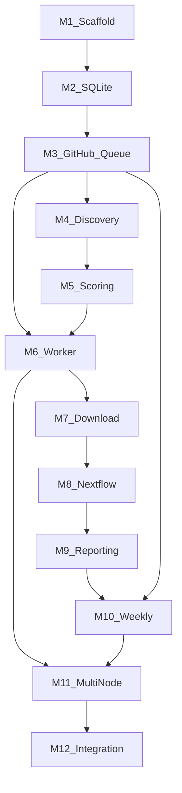

# Milestones

Development milestones for **public-omics-watchtower** Phase 1. All twelve milestones (M1–M12) are **complete** as of the initial implementation.

Recommended build order:

```
M1 → M2 → M3 → M4 → M5 → M6 → M7 → M8 → M9 → M10 → M11 → M12
```

M8 (Nextflow pipeline) can begin in parallel with M6–M7 once a test dataset is chosen, but system integration follows the dependency chain above.

---

## M1 — Repository Scaffold and Config Foundation

| Field | Value |
|-------|-------|
| **Status** | Complete |
| **Objective** | Establish project skeleton, packaging, and validated configuration loading |
| **Complexity** | Low |
| **Dependencies** | None |

### Components

- Directory layout
- `pyproject.toml`, `environment.yml`, `Makefile`
- Base YAML configs under `config/`
- `schemas/issue_body.schema.json`
- `.gitignore`, `.gitattributes`, `LICENSE`
- `.github/workflows/ci.yml`

### Success Criteria

- [x] `watchtower config validate` passes
- [x] CI runs Ruff and pytest
- [x] Config layers documented

### Key Files

`pyproject.toml`, `config/watchtower.yaml`, `watchtower/config/loader.py`, `watchtower/config/validator.py`

---

## M2 — SQLite Schema and Data Access Layer

| Field | Value |
|-------|-------|
| **Status** | Complete |
| **Objective** | Implement local persistence and migrations |
| **Complexity** | Low–Medium |
| **Dependencies** | M1 |

### Components

- `schemas/sqlite/001_initial.sql`
- `watchtower/db/migrations.py`
- `watchtower/db/connection.py`
- `watchtower/db/models.py`
- `watchtower/db/store.py`
- `tests/unit/test_db.py`

### Success Criteria

- [x] Migration applies cleanly on first connect
- [x] CRUD round-trips for datasets, jobs, pipeline runs, artifacts
- [x] Indexes on accession, status, relevance score

### Key Tables

`datasets`, `samples`, `jobs`, `job_events`, `pipeline_runs`, `artifacts`, `nodes`, `weekly_reports`, `report_items`

---

## M3 — GitHub Issues Queue Client

| Field | Value |
|-------|-------|
| **Status** | Complete |
| **Objective** | GitHub as authoritative distributed job queue |
| **Complexity** | Medium |
| **Dependencies** | M1, M2 |

### Components

- `watchtower/queue/github_issues.py` — create, claim, complete, fail, stale reclaim
- `watchtower/queue/models.py` — QueueJob, label helpers
- `.github/ISSUE_TEMPLATE/*.yml` — four job type templates
- `.github/labels.yml`, `scripts/setup_labels.sh`
- `tests/integration/test_github_queue_mock.py`

### Success Criteria

- [x] Worker can create, claim, complete, and fail issues
- [x] Concurrent claim results in exactly one winner
- [x] Issue bodies validated against JSON Schema

### Claim Protocol

1. Add `claimed-by:{node_id}` and `status:running`
2. Post comment with `job_id` and timestamp
3. On failure: `status:failed`, optional `needs:human`

---

## M4 — Discovery Module (SRA + GEO)

| Field | Value |
|-------|-------|
| **Status** | Complete |
| **Objective** | Find new C. gigas RNA-seq records from public repositories |
| **Complexity** | Medium |
| **Dependencies** | M2, M3 |

### Components

- `watchtower/discovery/entrez.py` — rate-limited Entrez client
- `watchtower/discovery/sra.py` — SRA search
- `watchtower/discovery/geo.py` — GEO search
- `config/repositories/sra.yaml`, `config/repositories/geo.yaml`
- `tests/unit/test_discovery.py`

### Success Criteria

- [x] Discovery populates SQLite with normalized dataset records
- [x] Metadata fields match schema (accession, title, organism, sample count)
- [x] Entrez rate limiting enforced

---

## M5 — Relevance Scoring and Prioritization

| Field | Value |
|-------|-------|
| **Status** | Complete |
| **Objective** | Rank datasets for marine stress biology relevance |
| **Complexity** | Medium |
| **Dependencies** | M4 |

### Components

- `watchtower/scoring/rules.py` — taxonomy, keyword, sample-count, design, recency scoring
- `watchtower/scoring/ranker.py` — DatasetRanker with queue decisions
- `config/scoring/relevance.yaml`
- `watchtower/ai/prioritizer.py` — NullPrioritizer stub
- `tests/unit/test_scoring.py`

### Success Criteria

- [x] Scores range 0–100 with documented breakdown
- [x] High-score datasets create download issues (threshold: 60)
- [x] Low-score datasets marked `skipped` (threshold: 20)
- [x] Scoring unit-tested with fixtures

### Scoring Weights (Default)

| Rule | Max Points |
|------|------------|
| Taxonomy match | 30 |
| Stress keyword match | 25 |
| Sample count | 15 |
| Study design | 15 |
| Recency | 15 |

---

## M6 — Worker Daemon and Job Dispatch

| Field | Value |
|-------|-------|
| **Status** | Complete |
| **Objective** | Long-running node agent that processes the queue |
| **Complexity** | Medium–High |
| **Dependencies** | M3, M5 |

### Components

- `watchtower/worker/daemon.py` — poll loop, job dispatch
- `watchtower/worker/node.py` — registration, heartbeat, capacity checks
- `watchtower/worker/handlers/` — discover, download, analyze, report
- `deploy/macos/bootstrap.sh`, `deploy/macos/install_worker.sh`
- `deploy/macos/launchd/com.uw.watchtower.worker.plist`
- `tests/unit/test_worker_node.py`

### Success Criteria

- [x] `watchtower worker run` polls and dispatches jobs
- [x] Node heartbeat recorded in SQLite
- [x] launchd plist provided for auto-restart

---

## M7 — Download and Staging

| Field | Value |
|-------|-------|
| **Status** | Complete |
| **Objective** | Retrieve SRA data and produce Nextflow sample sheets |
| **Complexity** | Medium–High |
| **Dependencies** | M6 |

### Components

- `watchtower/download/sra.py` — prefetch, fasterq-dump
- `watchtower/download/geo_download.py` — GEO-linked SRA accessions
- `watchtower/download/staging.py` — directory layout, sample sheet CSV
- `tests/unit/test_staging.py`

### Success Criteria

- [x] Download produces `samplesheet.csv` with sample_id, fastq paths, condition
- [x] Staging layout under `{data_root}/raw/{source}/{accession}/`
- [x] Disk space checked before download (via NodeManager)

### Staged Layout

```
{data_root}/raw/sra/{accession}/
├── *.sra
├── fastq/*.fastq.gz
└── samplesheet.csv
```

---

## M8 — Nextflow RNA-seq Pipeline (Salmon + DESeq2)

| Field | Value |
|-------|-------|
| **Status** | Complete |
| **Objective** | Reproducible analysis from FASTQ to DEG tables and plots |
| **Complexity** | High |
| **Dependencies** | M7, Salmon index built |

### Components

- `pipelines/rnaseq/main.nf` and modules (qc, salmon, deseq2, enrichment, reporting)
- `pipelines/rnaseq/bin/deseq2_analysis.R`
- `pipelines/rnaseq/bin/go_enrichment.R`
- `pipelines/rnaseq/bin/render_report.py`
- `pipelines/rnaseq/conf/mac_arm64.config`
- `references/crassostrea_gigas/manifest.yaml`

### Success Criteria

- [x] Nextflow config validates in CI
- [x] Pipeline produces DEG CSV, PCA PNG, volcano PNG, GO CSV, study report
- [x] `-with-report` and `-with-trace` captured per run
- [ ] End-to-end run on real test data (requires Salmon index on node)

### Outputs

`deg/deseq2_results.csv`, `plots/pca.png`, `plots/volcano_{contrast}.png`, `enrichment/go_enrichment.csv`, `report/study_report.md`

---

## M9 — GO Enrichment and Study Report Generation

| Field | Value |
|-------|-------|
| **Status** | Complete |
| **Objective** | Biological interpretation artifacts and per-study Markdown |
| **Complexity** | Medium |
| **Dependencies** | M8 |

### Components

- `pipelines/rnaseq/modules/enrichment.nf`
- `pipelines/rnaseq/modules/reporting.nf`
- `templates/reports/study_report.md.j2`
- Artifact registration in `watchtower/worker/handlers/analyze.py`

### Success Criteria

- [x] `study_report.md` generated with DEG summary and plot references
- [x] GO enrichment CSV has expected columns
- [x] Artifacts registered in SQLite `artifacts` table

### Note

C. gigas lacks a standard Bioconductor OrgDb. Phase 1 outputs `pending_annotation` placeholders until a custom gene-to-GO mapping is added in Phase 2.

---

## M10 — GitHub Reporting Sync and Weekly Digest

| Field | Value |
|-------|-------|
| **Status** | Complete |
| **Objective** | Publish results and produce weekly lab reports |
| **Complexity** | Medium |
| **Dependencies** | M9, M3 |

### Components

- `watchtower/reporting/weekly.py` — digest generator
- `watchtower/reporting/sync_reports.py` — push to `reports` branch
- `templates/reports/weekly_digest.md.j2`
- `.github/workflows/weekly_report.yml`
- `tests/unit/test_weekly.py`

### Success Criteria

- [x] Weekly digest markdown generated for trailing 7 days
- [x] GitHub Action cron triggers weekly report workflow
- [x] Weekly digest includes completed studies, new datasets, failed jobs

---

## M11 — Multi-Node Hardening

| Field | Value |
|-------|-------|
| **Status** | Complete |
| **Objective** | Reliable distributed operation across 2+ Mac minis |
| **Complexity** | Medium |
| **Dependencies** | M6, M10 |

### Components

- Stale claim reclaim in `watchtower/queue/github_issues.py`
- `watchtower/housekeeping.py` — fleet-wide housekeeping
- `watchtower worker housekeeping` CLI command
- Node capability routing in `watchtower/worker/node.py`
- `config/nodes/oyster-mini-01.yaml`, `config/nodes/oyster-mini-02.yaml`
- Housekeeping in `weekly_report.yml` Action

### Success Criteria

- [x] Stale claims auto-reclaimed after 24h
- [x] Nodes filter jobs by `capabilities.job_types` and `preferred_species`
- [x] No work stealing in Phase 1 (stale reclaim only)

---

## M12 — Phase 1 Integration and Operator UX

| Field | Value |
|-------|-------|
| **Status** | Complete |
| **Objective** | End-to-end autonomous operation for C. gigas RNA-seq |
| **Complexity** | Medium |
| **Dependencies** | M11 |

### Components

- `watchtower/cli.py` — full CLI: `config`, `discover`, `status`, `worker`, `report`, `retry`, `github`
- `docs/operations.md`, `deploy/docs/node_setup.md`
- `Makefile` — install, lint, test, validate
- `README.md` — quick start and CLI reference
- Top-level design docs: `ARCHITECTURE.md`, `ROADMAP.md`, `REPOSITORY_STRUCTURE.md`, `MILESTONES.md`

### Success Criteria

- [x] Operator can validate config, run discovery, check status, and start worker from CLI
- [x] Documented path from zero to running worker on Mac mini
- [x] 30 unit/integration tests passing
- [ ] Full unattended pipeline on new public dataset (pending production setup)

### CLI Commands

```bash
watchtower config validate
watchtower discover [--species crassostrea_gigas]
watchtower status
watchtower worker run --node-id oyster-mini-01 [--once]
watchtower worker housekeeping --node-id oyster-mini-01
watchtower report --weekly
watchtower retry <job_id>
watchtower github store-token
```

---

## Milestone Dependency Graph



---

## Post-Phase 1 Milestones (Planned)

These are not yet scheduled as development milestones. See [ROADMAP.md](ROADMAP.md) for detail.

| Milestone | Phase | Summary |
|-----------|-------|---------|
| P2-S1 | 2 | *Ostrea lurida* and *Ruditapes philippinarum* configs + references |
| P2-S2 | 2 | *Mytilus* spp., *Pycnopodia helianthoides*, coral species |
| P2-AI | 2 | Enable AI prioritizer and report interpreter providers |
| P2-GO | 2 | Species-specific GO annotation mappings |
| P3-META | 3 | Cross-study meta-analysis job type and schema |
| P3-ATLAS | 3 | Stress-response atlas and biomarker ranking |
| P3-AI | 3 | AI-assisted biomarker identification |

---

## Verification Checklist (Production Readiness)

Before declaring Phase 1 production-ready:

- [ ] Salmon index built at path in `references/crassostrea_gigas/manifest.yaml`
- [ ] GitHub labels created (`./scripts/setup_labels.sh`)
- [ ] `GITHUB_TOKEN` stored on each worker node
- [ ] External data volume mounted at configured `data_root`
- [ ] Both `oyster-mini-01` and `oyster-mini-02` workers running via launchd
- [ ] End-to-end test: discovery → download → analyze → report on one real accession
- [ ] Weekly digest published to `reports` branch
- [ ] Open decisions resolved (reference transcriptome, storage, token model)

See [ARCHITECTURE.md](ARCHITECTURE.md) for system design and [deploy/docs/node_setup.md](deploy/docs/node_setup.md) for setup steps.
